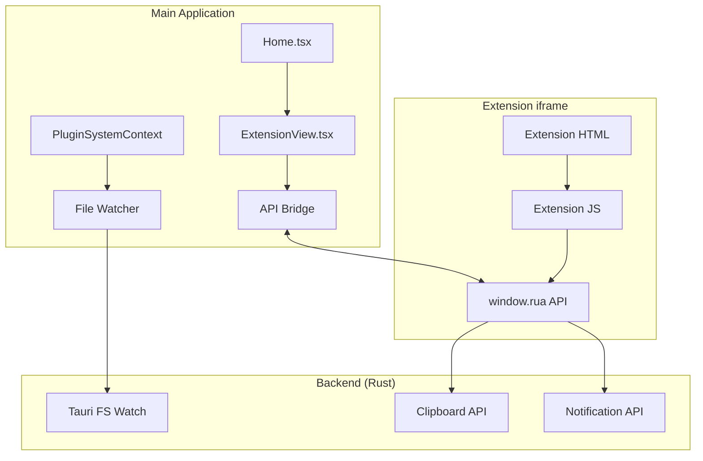
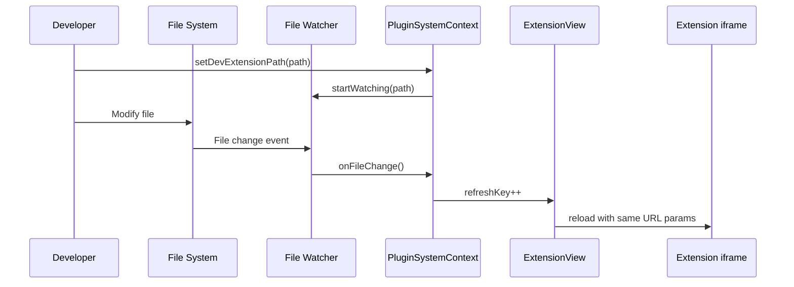
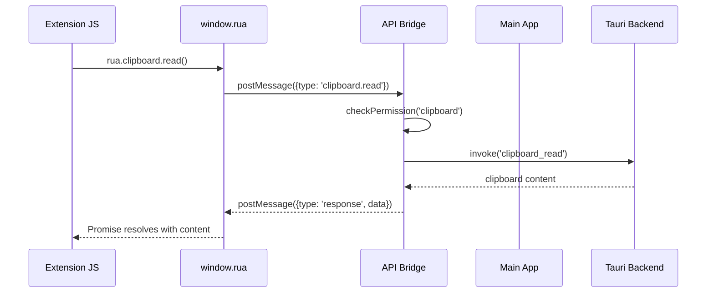

# Extension Enhancements Design Document

## Overview

本设计文档描述 Rua 扩展系统的增强功能，包括开发模式热重载、init.js 脚本执行、主界面控制 API 和扩展 iframe API 注入。

核心设计目标：
- **开发体验**: 通过热重载提升扩展开发效率
- **动态能力**: 支持通过 init.js 动态注册 Actions
- **交互能力**: 扩展可通过 API 控制主界面和访问系统功能
- **安全性**: 所有 API 调用都需要权限验证

## Architecture

### 系统架构图



### 热重载流程



### API 通信流程



## Components and Interfaces

### 1. File Watcher Service

```typescript
interface FileWatcherService {
  /** Start watching a directory for changes */
  startWatching(path: string, callback: () => void): Promise<void>;
  
  /** Stop watching the current directory */
  stopWatching(): Promise<void>;
  
  /** Check if currently watching */
  isWatching(): boolean;
}
```

### 2. Extension API (window.rua)

注入到扩展 iframe 中的 API 对象：

```typescript
interface RuaExtensionAPI {
  /** Extension metadata */
  extension: {
    id: string;
    name: string;
    version: string;
  };
  
  /** Clipboard operations (requires 'clipboard' permission) */
  clipboard: {
    read(): Promise<string>;
    write(text: string): Promise<void>;
  };
  
  /** Notification operations (requires 'notification' permission) */
  notification: {
    show(options: NotificationOptions): Promise<void>;
  };
  
  /** Storage operations (requires 'storage' permission) */
  storage: {
    get<T>(key: string): Promise<T | null>;
    set<T>(key: string, value: T): Promise<void>;
    remove(key: string): Promise<void>;
  };
  
  /** UI control operations */
  ui: {
    hideInput(): void;
    showInput(): void;
    close(): void;
    setTitle(title: string): void;
  };
  
  /** Dynamic action registration */
  actions: {
    register(actions: DynamicAction[]): void;
    unregister(actionIds: string[]): void;
  };
  
  /** Event system */
  on(event: string, handler: (data: unknown) => void): void;
  off(event: string, handler: (data: unknown) => void): void;
}

interface NotificationOptions {
  title: string;
  body?: string;
  icon?: string;
}

interface DynamicAction {
  id: string;
  name: string;
  keywords?: string[];
  icon?: string;
  subtitle?: string;
  mode: 'view' | 'command';
}
```

### 3. API Bridge

主应用与 iframe 之间的通信桥梁：

```typescript
interface APIBridge {
  /** Initialize bridge for an iframe */
  init(iframe: HTMLIFrameElement, extensionInfo: ExtensionInfo): void;
  
  /** Handle message from iframe */
  handleMessage(event: MessageEvent): void;
  
  /** Send response to iframe */
  sendResponse(requestId: string, data: unknown, error?: string): void;
  
  /** Cleanup when iframe is destroyed */
  destroy(): void;
}

interface BridgeMessage {
  type: string;
  requestId: string;
  payload?: unknown;
}

interface BridgeResponse {
  type: 'response';
  requestId: string;
  data?: unknown;
  error?: string;
}
```

### 4. Init Script Executor

```typescript
interface InitScriptExecutor {
  /** Execute init.js for an extension */
  execute(
    extensionPath: string,
    initScript: string,
    api: InitAPI
  ): Promise<void>;
}

interface InitAPI {
  /** Register dynamic actions */
  registerActions(actions: DynamicAction[]): void;
  
  /** Log messages */
  log(message: string): void;
  
  /** Extension storage */
  storage: {
    get<T>(key: string): Promise<T | null>;
    set<T>(key: string, value: T): Promise<void>;
  };
}
```

### 5. Updated ExtensionView Component

```typescript
interface ExtensionViewProps {
  uiEntry: string;
  extensionName: string;
  extensionId: string;
  permissions: string[];
  onReturn: () => void;
  onInputVisibilityChange?: (visible: boolean) => void;
  refreshKey?: number;
}
```

### 6. Updated PluginSystemContext

```typescript
interface PluginSystemContextValue {
  // ... existing fields ...
  
  /** Dev mode file watcher */
  devWatcherActive: boolean;
  
  /** Refresh key for dev mode hot reload */
  devRefreshKey: number;
  
  /** Dynamic actions registered by extensions */
  dynamicActions: Map<string, DynamicAction[]>;
  
  /** Register dynamic actions for an extension */
  registerDynamicActions(extensionId: string, actions: DynamicAction[]): void;
  
  /** Unregister dynamic actions for an extension */
  unregisterDynamicActions(extensionId: string, actionIds?: string[]): void;
  
  /** Input visibility state controlled by extensions */
  inputHidden: boolean;
  setInputHidden(hidden: boolean): void;
}
```

## Data Models

### Message Protocol

iframe 与主应用之间的消息协议：

```typescript
// Request from iframe to main app
interface APIRequest {
  type: 'api-request';
  requestId: string;
  method: string;  // e.g., 'clipboard.read', 'ui.hideInput'
  args?: unknown[];
}

// Response from main app to iframe
interface APIResponse {
  type: 'api-response';
  requestId: string;
  success: boolean;
  data?: unknown;
  error?: string;
}

// Event from main app to iframe
interface APIEvent {
  type: 'api-event';
  event: string;
  data?: unknown;
}
```

### Dynamic Action Storage

```typescript
interface DynamicActionState {
  extensionId: string;
  actions: DynamicAction[];
  registeredAt: string;
}
```

## Correctness Properties

*A property is a characteristic or behavior that should hold true across all valid executions of a system-essentially, a formal statement about what the system should do. Properties serve as the bridge between human-readable specifications and machine-verifiable correctness guarantees.*

### Property 1: File Watcher Lifecycle

*For any* dev extension path, when dev mode is started, a file watcher SHALL be active for that path, and when dev mode is stopped, the watcher SHALL be inactive.

**Validates: Requirements 1.1, 1.4**

### Property 2: File Change Triggers Refresh

*For any* file change in the dev extension directory, the extension iframe refresh key SHALL increment, causing a reload.

**Validates: Requirements 1.2**

### Property 3: URL Parameters Preserved on Refresh

*For any* extension iframe with URL parameters, after a refresh triggered by file change, the URL parameters SHALL be identical to before the refresh.

**Validates: Requirements 1.3**

### Property 4: Init Script Execution

*For any* extension with an init field in manifest, when the extension is loaded, the init script SHALL be executed exactly once.

**Validates: Requirements 2.1**

### Property 5: Init Script Error Isolation

*For any* init script that throws an error, the extension SHALL still load successfully, and the error SHALL be logged.

**Validates: Requirements 2.4**

### Property 6: Dynamic Action Registration Round-Trip

*For any* set of valid dynamic actions registered via init.js or the API, those actions SHALL appear in the command palette, and when unregistered, they SHALL be removed.

**Validates: Requirements 2.3, 5.1, 5.2**

### Property 7: Action Cleanup on Extension Disable

*For any* extension with dynamically registered actions, when the extension is disabled or unloaded, all its dynamic actions SHALL be removed from the command palette.

**Validates: Requirements 2.5, 5.4**

### Property 8: Input Visibility Control

*For any* sequence of hideInput/showInput API calls, the input visibility state SHALL match the most recent call, and when the extension view closes, the input SHALL be visible.

**Validates: Requirements 3.1, 3.2, 3.3, 3.4, 4.8, 4.9**

### Property 9: API Injection

*For any* extension iframe that loads successfully, the window.rua object SHALL be defined and contain all API methods.

**Validates: Requirements 4.1**

### Property 10: Permission Enforcement

*For any* API call that requires a permission, if the extension does not have that permission, the call SHALL be rejected with a permission error.

**Validates: Requirements 4.2**

### Property 11: Clipboard Round-Trip

*For any* text written to clipboard via clipboard.write, a subsequent clipboard.read SHALL return the same text.

**Validates: Requirements 4.3, 4.4**

### Property 12: Storage Round-Trip

*For any* value stored via storage.set, a subsequent storage.get with the same key SHALL return an equivalent value.

**Validates: Requirements 4.6, 4.7**

### Property 13: Extension Close

*For any* extension view, when ui.close is called, the view SHALL close and the main view SHALL be displayed.

**Validates: Requirements 4.10**

### Property 14: Dynamic Action Routing

*For any* dynamically registered action that is selected, the action SHALL be routed to the extension that registered it.

**Validates: Requirements 5.3**

## Error Handling

### Init Script Errors

| Error Type | Handling Strategy |
|------------|-------------------|
| Script not found | Log warning, continue without dynamic actions |
| Syntax error | Log error with details, continue without dynamic actions |
| Runtime error | Catch error, log with stack trace, continue |
| Timeout (>3s) | Log timeout warning, continue without dynamic actions |

### API Call Errors

| Error Type | Handling Strategy |
|------------|-------------------|
| Permission denied | Return error response with 'PERMISSION_DENIED' code |
| Invalid arguments | Return error response with 'INVALID_ARGS' code |
| Backend error | Return error response with original error message |
| Timeout | Return error response with 'TIMEOUT' code |

### File Watcher Errors

| Error Type | Handling Strategy |
|------------|-------------------|
| Path not found | Log error, disable dev mode |
| Permission denied | Log error, disable dev mode |
| Watcher crash | Attempt restart, log if fails |

## Testing Strategy

### Dual Testing Approach

本项目采用单元测试和属性测试相结合的方式：

**单元测试**:
- 测试 API Bridge 消息处理
- 测试权限检查逻辑
- 测试 init script 执行器

**属性测试**:
- 使用 fast-check 库进行属性测试
- 每个属性测试运行至少 100 次迭代
- 测试标注格式: `**Feature: extension-enhancements, Property {number}: {property_text}**`

### Test File Structure

```
apps/rua/src/
├── __tests__/
│   ├── api-bridge.test.ts
│   ├── api-bridge.property.test.ts
│   ├── init-executor.test.ts
│   └── file-watcher.test.ts
```

