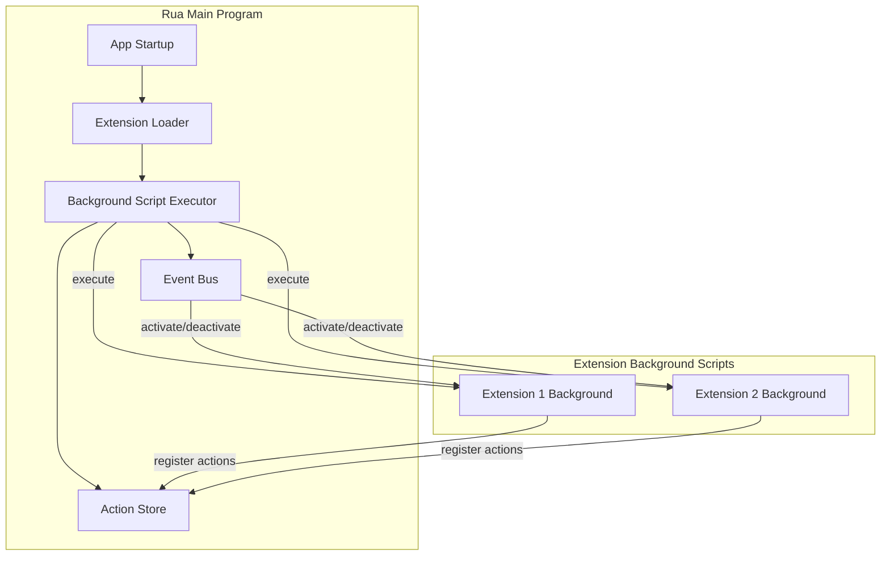

# Design Document: Background Action Mode

## Overview

This feature introduces a `background` action mode for extensions. Background actions are scripts that run automatically when the rua application starts, executing directly in the main program context (not in iframes). This provides a simpler, more efficient alternative to the current iframe-based init script approach.

Key benefits:
- No iframe overhead or RPC communication
- Direct access to the main program context
- Simpler API for extension developers
- One background action per extension (enforced by manifest validation)

## Architecture



## Components and Interfaces

### 1. ActionMode Type Update

Update the `ActionMode` type in `packages/rua-api/src/types/manifest.ts`:

```typescript
export type ActionMode =
    | 'view'           // Opens a custom UI view
    | 'command'        // Executes a command without UI (on demand)
    | 'background';    // Runs automatically on startup
```

### 2. Manifest Validation

Add validation in the extension loader to ensure:
- At most one `background` action per extension
- `background` actions must have a `script` field

```typescript
interface ManifestValidationResult {
    valid: boolean;
    errors: string[];
}

function validateManifest(manifest: ExtensionManifest): ManifestValidationResult {
    const errors: string[] = [];
    const backgroundActions = manifest.rua.actions.filter(a => a.mode === 'background');
    
    if (backgroundActions.length > 1) {
        errors.push('Extension can have at most one background action');
    }
    
    for (const action of backgroundActions) {
        if (!action.script) {
            errors.push(`Background action "${action.name}" must have a script field`);
        }
    }
    
    return { valid: errors.length === 0, errors };
}
```

### 3. Background Script Executor

New module `apps/rua/src/lib/background-executor.ts`:

```typescript
interface BackgroundScriptState {
    extensionId: string;
    cleanup: () => void;
    activateCallbacks: Set<() => void>;
    deactivateCallbacks: Set<() => void>;
}

// Registry of loaded background scripts
const backgroundScripts = new Map<string, BackgroundScriptState>();

// Execute a background script for an extension
async function executeBackgroundScript(
    extensionId: string,
    scriptPath: string,
    permissions: string[]
): Promise<boolean>;

// Notify all extensions of activation
async function notifyActivate(): Promise<void>;

// Notify all extensions of deactivation  
async function notifyDeactivate(): Promise<void>;

// Clean up a specific extension
function cleanupExtension(extensionId: string): void;
```

### 4. Main Context Rua API

New module `packages/rua-api/src/browser/main-context-api.ts`:

```typescript
export interface MainContextRuaAPI {
    extension: ExtensionMeta;
    
    storage: {
        get<T>(key: string): Promise<T | null>;
        set<T>(key: string, value: T): Promise<void>;
        remove(key: string): Promise<void>;
    };
    
    actions: {
        register(actions: DynamicAction[]): Promise<void>;
        unregister(actionIds: string[]): Promise<void>;
    };
    
    on(event: 'activate' | 'deactivate', callback: () => void): void;
    off(event: 'activate' | 'deactivate', callback: () => void): void;
}

// Create API for main context usage
export function createMainContextRuaAPI(
    extensionId: string,
    callbacks: BackgroundScriptCallbacks
): MainContextRuaAPI;
```

### 5. Script Loading Strategy

Background scripts are loaded using dynamic `import()`:

```typescript
async function loadBackgroundScript(scriptPath: string): Promise<void> {
    // Convert ext:// path to importable URL
    const importUrl = convertToImportUrl(scriptPath);
    
    // Set global extension ID before import
    (window as any).__RUA_EXTENSION_ID__ = extensionId;
    
    // Dynamic import with timeout
    const timeoutPromise = new Promise((_, reject) => 
        setTimeout(() => reject(new Error('Script load timeout')), 5000)
    );
    
    await Promise.race([
        import(/* @vite-ignore */ importUrl),
        timeoutPromise
    ]);
}
```

## Data Models

### Background Action in Manifest

```typescript
// Example manifest with background action
{
    "id": "author.my-extension",
    "name": "My Extension",
    "version": "1.0.0",
    "rua": {
        "engineVersion": "^0.1.0",
        "actions": [
            {
                "name": "background-init",
                "title": "Background Initializer",
                "mode": "background",
                "script": "dist/background.js"
            },
            {
                "name": "main-view",
                "title": "Open Main View",
                "mode": "view"
            }
        ]
    }
}
```

### Background Script State

```typescript
interface BackgroundScriptState {
    extensionId: string;
    scriptPath: string;
    loaded: boolean;
    error?: string;
    activateCallbacks: Set<() => void>;
    deactivateCallbacks: Set<() => void>;
    registeredActions: string[];
}
```

## Correctness Properties

*A property is a characteristic or behavior that should hold true across all valid executions of a system-essentially, a formal statement about what the system should do. Properties serve as the bridge between human-readable specifications and machine-verifiable correctness guarantees.*

### Property 1: Manifest Validation - Single Background Action
*For any* extension manifest with multiple actions where `mode === 'background'`, the manifest validation SHALL return an error indicating only one background action is allowed.
**Validates: Requirements 1.2**

### Property 2: Manifest Validation - Background Action Requires Script
*For any* extension manifest with a background action that has no `script` field, the manifest validation SHALL return an error indicating the script field is required.
**Validates: Requirements 1.3**

### Property 3: Action Registration Round-Trip
*For any* valid array of dynamic actions, registering them via `rua.actions.register()` and then checking the action store SHALL result in all actions being present in the store.
**Validates: Requirements 3.2**

### Property 4: Action Unregistration
*For any* set of registered action IDs, calling `rua.actions.unregister(actionIds)` SHALL result in those actions being removed from the action store.
**Validates: Requirements 3.3**

### Property 5: Extension Cleanup Removes Actions
*For any* extension with registered dynamic actions, disabling or uninstalling the extension SHALL result in all its dynamic actions being removed from the action store.
**Validates: Requirements 3.4**

### Property 6: Activate Event Dispatch
*For any* set of extensions with registered activate callbacks, triggering window activation SHALL call all registered activate callbacks exactly once.
**Validates: Requirements 4.1, 4.3**

### Property 7: Deactivate Event Dispatch
*For any* set of extensions with registered deactivate callbacks, triggering window deactivation SHALL call all registered deactivate callbacks exactly once.
**Validates: Requirements 4.2, 4.4**

### Property 8: Storage Round-Trip
*For any* extension ID, key, and JSON-serializable value, calling `rua.storage.set(key, value)` followed by `rua.storage.get(key)` SHALL return a value equivalent to the original.
**Validates: Requirements 5.1, 5.2**

### Property 9: Storage Removal
*For any* extension ID and key with a stored value, calling `rua.storage.remove(key)` followed by `rua.storage.get(key)` SHALL return null.
**Validates: Requirements 5.3**

### Property 10: API Object Structure
*For any* valid extension ID, calling `createMainContextRuaAPI(extensionId, callbacks)` SHALL return an object with `extension`, `storage`, `actions`, `on`, and `off` properties.
**Validates: Requirements 6.2**

## Error Handling

### Script Load Errors

```typescript
try {
    await loadBackgroundScript(scriptPath);
} catch (error) {
    console.error(`[BackgroundExecutor] Failed to load script for ${extensionId}:`, error);
    // Continue loading other extensions
    backgroundScripts.set(extensionId, {
        extensionId,
        loaded: false,
        error: error.message,
        // ... other fields
    });
}
```

### Timeout Handling

Scripts that take longer than 5 seconds to initialize will be logged as warnings but won't block other extensions:

```typescript
const SCRIPT_TIMEOUT = 5000;

const result = await Promise.race([
    executeScript(),
    new Promise((_, reject) => 
        setTimeout(() => reject(new Error('Initialization timeout')), SCRIPT_TIMEOUT)
    )
]);
```

### Permission Errors

Storage and other API calls will throw descriptive errors if permissions are missing:

```typescript
if (!hasPermission(extensionInfo, 'storage')) {
    throw new Error('PERMISSION_DENIED: storage permission required');
}
```

## Migration Notes

### Deprecation of `rua.init`

The `rua.init` field in manifest will be deprecated in favor of background actions. Extensions should migrate from:

```json
{
    "rua": {
        "init": "dist/init.js",
        "actions": [...]
    }
}
```

To:

```json
{
    "rua": {
        "actions": [
            {
                "name": "background",
                "title": "Background",
                "mode": "background",
                "script": "dist/init.js"
            },
            ...
        ]
    }
}
```

### Backward Compatibility

During the transition period, the system will:
1. Support both `rua.init` and background actions
2. Log deprecation warnings for `rua.init` usage
3. Eventually remove `rua.init` support in a future version
