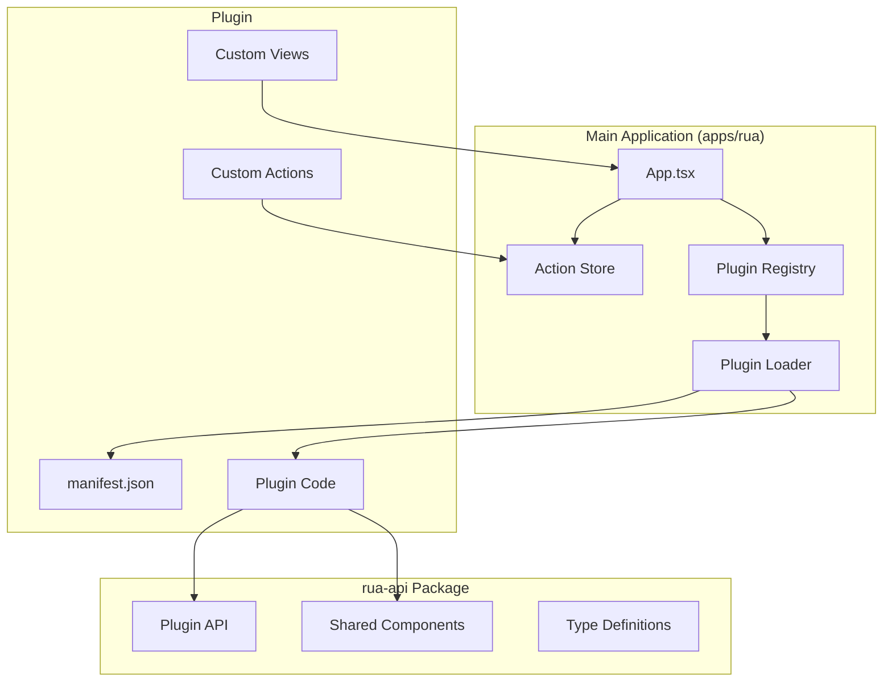
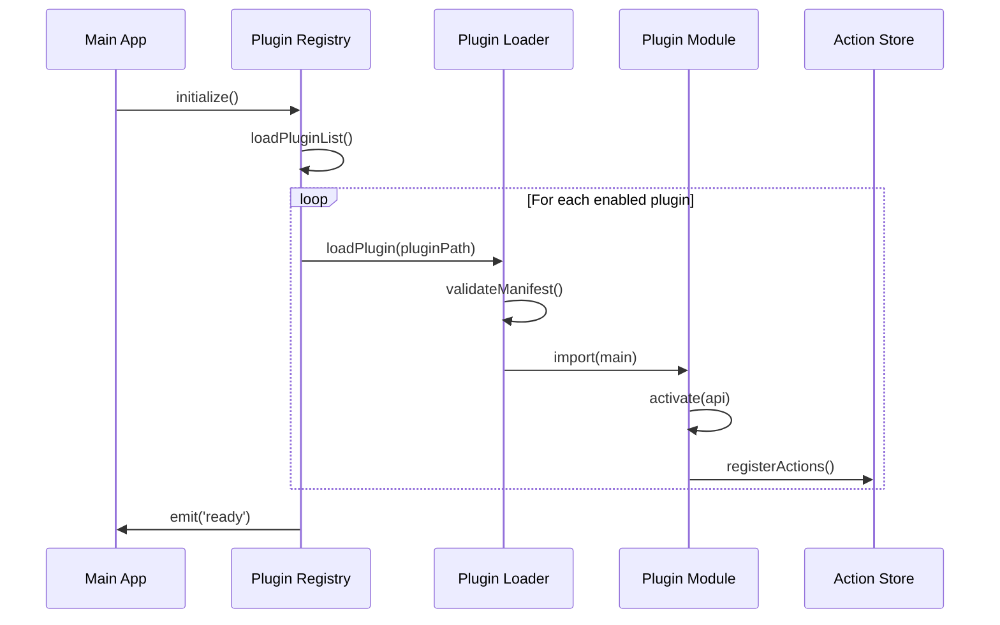

# Plugin System Design Document

## Overview

本设计文档描述 Rua 命令面板应用的插件系统架构。该系统采用 monorepo 结构，将主应用与插件 API 分离，使插件开发者能够独立开发和分发插件。

核心设计目标：
- **模块化**: 通过 monorepo workspaces 实现代码分离
- **可扩展性**: 插件可注册 Actions、自定义视图和数据处理逻辑
- **安全性**: 通过权限系统和沙箱环境限制插件能力
- **性能**: 异步加载插件，不阻塞主界面

## Architecture

### 项目结构

```
rua/
├── package.json                 # Workspace 根配置
├── apps/
│   └── rua/                     # 主应用
│       ├── src/                 # React 前端 (原 src/)
│       ├── src-tauri/           # Rust 后端 (原 src-tauri/)
│       └── package.json
├── packages/
│   └── rua-api/                 # 插件 API 包
│       ├── src/
│       │   ├── index.ts         # 主入口
│       │   ├── api/             # Plugin API 定义
│       │   ├── components/      # 共享 UI 组件
│       │   └── types/           # TypeScript 类型定义
│       └── package.json
└── plugins/                     # 示例插件目录 (可选)
```

### 系统架构图



### 插件加载流程



## Components and Interfaces

### 1. Plugin Manifest (manifest.json)

设计参考 [KunKun Extensions](https://docs.kunkun.sh/extensions/)，支持一个插件定义多个 Actions。

```typescript
interface PluginManifest {
  // 必填字段
  id: string;           // 唯一标识符，格式: author.plugin-name
  name: string;         // 显示名称
  version: string;      // 语义化版本号
  
  // Rua 特定配置
  rua: {
    engineVersion: string;  // 最低引擎版本要求
    ui?: {
      entry: string;        // UI 入口 HTML 文件
      width?: number;
      height?: number;
    };
    init?: string;          // 初始化脚本，应用启动时执行
    actions: ManifestAction[];  // 插件定义的 Actions
  };
  
  // 可选字段
  description?: string;
  author?: string;
  homepage?: string;
  repository?: string;
  keywords?: string[];
  icon?: string;
  permissions?: PluginPermission[];
  dependencies?: Record<string, string>;
}

interface ManifestAction {
  name: string;         // Action 标识符
  title: string;        // 显示标题
  mode: 'view' | 'command';  // view=打开UI, command=执行脚本
  keywords?: string[];
  icon?: string;
  subtitle?: string;
  shortcut?: string[];
  script?: string;      // command 模式下执行的脚本
}

type PluginPermission = 
  | 'clipboard'      // 剪贴板读写
  | 'notification'   // 系统通知
  | 'storage'        // 本地存储
  | 'http'           // HTTP 请求
  | 'shell';         // Shell 命令执行
```

**示例 manifest.json:**

```json
{
  "id": "author.my-plugin",
  "name": "My Plugin",
  "version": "1.0.0",
  "rua": {
    "engineVersion": "^0.1.0",
    "ui": {
      "entry": "index.html"
    },
    "init": "init.js",
    "actions": [
      {
        "name": "open-baidu",
        "title": "打开百度",
        "mode": "view",
        "keywords": ["search", "baidu"]
      },
      {
        "name": "play-music",
        "title": "播放音乐",
        "mode": "view"
      }
    ]
  },
  "permissions": ["http", "storage"]
}
```

**Action 路由机制:**

当用户选择一个 `mode: "view"` 的 Action 时，主应用会加载插件的 UI 入口文件，并通过 URL 参数传递 action 信息：

```
plugin://author.my-plugin/index.html?action=open-baidu
```

插件 UI 端可以通过解析 `URLSearchParams` 来判断当前激活的 action 并渲染对应视图。

### 2. Plugin API Interface

```typescript
interface PluginAPI {
  // Action 注册
  registerActions(actions: PluginAction[]): void;
  unregisterActions(actionIds: string[]): void;
  
  // 视图注册
  registerView(actionId: string, component: React.ComponentType<ViewProps>): void;
  
  // 工具方法
  clipboard: {
    read(): Promise<string>;
    write(text: string): Promise<void>;
  };
  
  notification: {
    show(options: NotificationOptions): Promise<void>;
  };
  
  storage: {
    get<T>(key: string): Promise<T | null>;
    set<T>(key: string, value: T): Promise<void>;
    remove(key: string): Promise<void>;
  };
  
  // 事件系统
  on(event: string, handler: EventHandler): void;
  off(event: string, handler: EventHandler): void;
  emit(event: string, data?: unknown): void;
}
```

### 3. Plugin Action Interface

```typescript
interface PluginAction {
  id: string;              // 会自动添加插件 ID 前缀
  name: string;
  keywords?: string;
  icon?: string | React.ReactNode;
  subtitle?: string;
  shortcut?: string[];
  section?: string;
  parent?: string;
  priority?: number;
  
  // 执行逻辑
  perform?: (context: ActionContext) => void | Promise<void>;
  
  // 自定义视图
  view?: React.ComponentType<ViewProps>;
  
  // 视图配置
  query?: boolean;
  hideSearchBox?: boolean;
  disableSearchFocus?: boolean;
}
```

### 4. Plugin Registry

```typescript
interface PluginRegistry {
  // 插件管理
  install(pluginPath: string): Promise<PluginInfo>;
  uninstall(pluginId: string): Promise<void>;
  enable(pluginId: string): Promise<void>;
  disable(pluginId: string): Promise<void>;
  
  // 查询
  getPlugin(pluginId: string): PluginInfo | null;
  getAllPlugins(): PluginInfo[];
  getEnabledPlugins(): PluginInfo[];
  
  // 事件
  on(event: PluginRegistryEvent, handler: EventHandler): void;
}

interface PluginInfo {
  manifest: PluginManifest;
  enabled: boolean;
  loaded: boolean;
  path: string;
  actions: string[];  // 已注册的 Action IDs
  error?: string;     // 加载错误信息
}

type PluginRegistryEvent = 
  | 'plugin:installed'
  | 'plugin:uninstalled'
  | 'plugin:enabled'
  | 'plugin:disabled'
  | 'plugin:loaded'
  | 'plugin:error'
  | 'ready';
```

### 5. Plugin Loader

```typescript
interface PluginLoader {
  load(pluginPath: string): Promise<LoadedPlugin>;
  unload(pluginId: string): Promise<void>;
  validateManifest(manifest: unknown): PluginManifest;
}

interface LoadedPlugin {
  manifest: PluginManifest;
  module: PluginModule;
  api: PluginAPI;
}

interface PluginModule {
  activate(api: PluginAPI): void | Promise<void>;
  deactivate?(): void | Promise<void>;
}
```

## Data Models

### Plugin State Storage

插件状态存储在用户数据目录下：

```
~/.config/rua/  (Linux)
~/Library/Application Support/rua/  (macOS)
%APPDATA%/rua/  (Windows)
├── plugins/
│   ├── installed/           # 已安装插件目录
│   │   ├── author.plugin-1/
│   │   │   ├── manifest.json
│   │   │   ├── index.js
│   │   │   └── ...
│   │   └── author.plugin-2/
│   └── registry.json        # 插件注册表状态
└── config.json              # 应用配置
```

### Registry State (registry.json)

```typescript
interface RegistryState {
  version: number;
  plugins: Record<string, PluginState>;
}

interface PluginState {
  id: string;
  enabled: boolean;
  installedAt: string;    // ISO 8601 timestamp
  updatedAt: string;
  version: string;
  settings?: Record<string, unknown>;
}
```


## Correctness Properties

*A property is a characteristic or behavior that should hold true across all valid executions of a system-essentially, a formal statement about what the system should do. Properties serve as the bridge between human-readable specifications and machine-verifiable correctness guarantees.*

Based on the prework analysis, the following properties have been identified. After reflection to eliminate redundancy, properties testing similar behaviors have been consolidated.

### Property 1: Manifest Validation Rejects Invalid Manifests

*For any* JSON object that is missing one or more of the required fields (id, name, version, main), the manifest validator SHALL reject it and return an error.

**Validates: Requirements 1.2, 3.1**

### Property 2: Plugin State Serialization Round-Trip

*For any* valid PluginState object, serializing to JSON and then deserializing SHALL produce an equivalent object.

**Validates: Requirements 3.3**

### Property 3: Plugin Enable/Disable State Persistence

*For any* plugin with a given enabled/disabled state, after persisting and restoring the registry state, the plugin SHALL have the same enabled/disabled state.

**Validates: Requirements 2.1, 2.2, 2.3**

### Property 4: Action Registration with Namespace Prefix

*For any* valid Action registered by a plugin, the Action's ID in the Action Store SHALL be prefixed with the plugin's ID.

**Validates: Requirements 4.1**

### Property 5: Parent Action Validation

*For any* Action registration that specifies a non-existent parent ID, the registration SHALL be rejected with an error.

**Validates: Requirements 4.2**

### Property 6: Plugin Unload Removes All Actions

*For any* plugin that has registered N actions, after unloading the plugin, the Action Store SHALL contain zero actions with that plugin's namespace prefix.

**Validates: Requirements 4.3**

### Property 7: Permission Enforcement

*For any* API call that requires a permission P, if the calling plugin does not have permission P, the call SHALL be rejected.

**Validates: Requirements 5.1, 5.2**

### Property 8: Plugin Details Display Completeness

*For any* plugin with a manifest containing description, author, and permissions, the plugin details display SHALL include all of these fields.

**Validates: Requirements 3.4, 6.3**

### Property 9: Scoped Context Contains Only Permitted APIs

*For any* plugin view component context, the context SHALL only contain APIs for which the plugin has declared permissions.

**Validates: Requirements 7.2**

## Error Handling

### Plugin Loading Errors

| Error Type | Handling Strategy |
|------------|-------------------|
| Invalid manifest | Reject installation, return descriptive error |
| Missing entry file | Reject installation, log error |
| Duplicate plugin ID | Prompt for upgrade confirmation |
| Load timeout (>5s) | Log warning, continue loading other plugins |
| Runtime error in plugin | Catch error, disable plugin, show error notification |

### Plugin Execution Errors

```typescript
interface PluginError {
  pluginId: string;
  type: 'load' | 'runtime' | 'permission' | 'timeout';
  message: string;
  stack?: string;
  timestamp: string;
}
```

### Error Boundary for Plugin Views

```typescript
class PluginErrorBoundary extends React.Component<Props, State> {
  static getDerivedStateFromError(error: Error): State {
    return { hasError: true, error };
  }
  
  render() {
    if (this.state.hasError) {
      return <PluginErrorFallback 
        pluginId={this.props.pluginId}
        error={this.state.error}
      />;
    }
    return this.props.children;
  }
}
```

## Testing Strategy

本项目暂不包含自动化测试，后续可根据需要添加。
