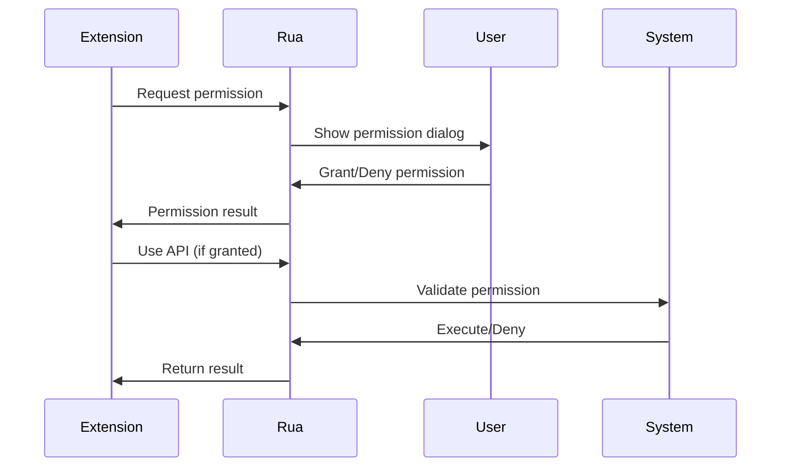

# Permission System

Rua's permission system provides secure, granular control over what system resources your extensions can access. This guide covers how to request, configure, and use permissions effectively while maintaining security.

## Security Model

Rua follows the **principle of least privilege** - extensions only get access to the specific resources they need, nothing more.

### Key Principles

1. **Explicit Permissions**: Extensions must explicitly request each permission
2. **User Consent**: Users see and approve all requested permissions
3. **Granular Control**: Fine-grained control over what resources can be accessed
4. **Runtime Enforcement**: Permissions are enforced at runtime, not just installation
5. **Revocable**: Users can revoke permissions at any time

### Permission Flow



## Permission Types

### Simple Permissions

Basic permissions that don't require additional configuration:

```json
{
  "permissions": [
    "clipboard",
    "notification",
    "storage",
    "http"
  ]
}
```

### Detailed Permissions

Complex permissions with specific access rules:

```json
{
  "permissions": [
    {
      "permission": "fs:read",
      "allow": [
        { "path": "$HOME/Documents/**" }
      ]
    },
    {
      "permission": "shell",
      "allow": [
        {
          "cmd": {
            "program": "git",
            "args": ["status", "log"]
          }
        }
      ]
    }
  ]
}
```

## Available Permissions

### Basic System Access

#### Clipboard Permission

Access to system clipboard for reading and writing text.

```json
{
  "permissions": ["clipboard"]
}
```

**API Usage**:
```typescript
// Read clipboard content
const text = await rua.clipboard.readText();

// Write to clipboard
await rua.clipboard.writeText('Hello, World!');
```

**Use Cases**:
- Text processing utilities
- Code snippet managers
- Data transformation tools
- Quick copy/paste operations

**Security Notes**:
- Can access sensitive clipboard data
- Users should be aware of clipboard monitoring

#### Storage Permission

Local data persistence for extension settings and cache.

```json
{
  "permissions": ["storage"]
}
```

**API Usage**:
```typescript
// Store data
await rua.storage.set('settings', { theme: 'dark' });

// Retrieve data
const settings = await rua.storage.get('settings');

// Remove data
await rua.storage.remove('cache');
```

**Use Cases**:
- User preferences and settings
- Caching frequently used data
- Session state persistence
- Extension configuration

**Security Notes**:
- Data is isolated per extension
- No access to other extensions' data
- Stored locally on user's machine

#### Notification Permission

Display system notifications to the user.

```json
{
  "permissions": ["notification"]
}
```

**API Usage**:
```typescript
// Show basic notification
await rua.notification.show({
  title: 'Task Complete',
  body: 'Your file has been processed successfully'
});

// Notification with icon and actions
await rua.notification.show({
  title: 'New Message',
  body: 'You have 3 unread messages',
  icon: 'path/to/icon.png',
  actions: [
    { action: 'view', title: 'View Messages' },
    { action: 'dismiss', title: 'Dismiss' }
  ]
});
```

**Use Cases**:
- Progress notifications
- Alert messages
- Status updates
- User reminders

### Network Access

#### HTTP Permission

Make HTTP requests to external services.

**Unrestricted HTTP access:**
```json
{
  "permissions": ["http"]
}
```
Allows requests to any URL. Use with caution.

**Domain-restricted access:**
```json
{
  "permissions": [
    {
      "permission": "http",
      "allow": [
        { "url": "https://api.github.com/**" },
        { "url": "https://httpbin.org/**" }
      ]
    }
  ]
}
```
Recommended for production extensions.

**Method and header restrictions:**
```json
{
  "permissions": [
    {
      "permission": "http",
      "allow": [
        {
          "url": "https://api.example.com/**",
          "methods": ["GET", "POST"],
          "headers": {
            "User-Agent": "MyExtension/1.0"
          }
        }
      ]
    }
  ]
}
```

**API Usage**:
```typescript
// GET request
const response = await fetch('https://api.github.com/user');
const data = await response.json();

// POST request with data
const result = await fetch('https://api.example.com/data', {
  method: 'POST',
  headers: {
    'Content-Type': 'application/json'
  },
  body: JSON.stringify({ key: 'value' })
});
```

**Use Cases**:
- API integrations
- Data fetching from web services
- Authentication with external services
- Real-time data updates

**Security Notes**:
- Can access external services
- May send user data over network
- Consider using domain restrictions

### File System Access

File system permissions provide controlled access to files and directories.

#### Read Permission

Read files from the file system.

```json
{
  "permissions": [
    {
      "permission": "fs:read",
      "allow": [
        { "path": "$HOME/Documents/**" },
        { "path": "$HOME/Downloads/*.txt" },
        { "path": "/etc/hosts" }
      ]
    }
  ]
}
```

**API Usage**:
```typescript
// Read text file
const content = await rua.fs.readTextFile('$HOME/Documents/notes.txt');

// Read binary file
const data = await rua.fs.readBinaryFile('$HOME/Downloads/image.png');

// Check if file exists
const exists = await rua.fs.exists('$HOME/Documents/config.json');
```

#### Write Permission

Write files to the file system.

```json
{
  "permissions": [
    {
      "permission": "fs:write",
      "allow": [
        { "path": "$HOME/Documents/MyExtension/**" },
        { "path": "$HOME/temp/**" }
      ]
    }
  ]
}
```

**API Usage**:
```typescript
// Write text file
await rua.fs.writeTextFile(
  '$HOME/Documents/output.txt', 
  'Hello, World!'
);

// Write binary file
const imageData = new Uint8Array([...]);
await rua.fs.writeBinaryFile(
  '$HOME/Documents/image.png', 
  imageData
);
```

#### Directory Operations

List and navigate directory contents.

```json
{
  "permissions": [
    {
      "permission": "fs:read-dir",
      "allow": [
        { "path": "$HOME/Documents/**" }
      ]
    }
  ]
}
```

**API Usage**:
```typescript
// List directory contents
const entries = await rua.fs.readDir('$HOME/Documents');

entries.forEach(entry => {
  console.log(`${entry.name} (${entry.isFile ? 'file' : 'directory'})`);
});

// Get file metadata
const stat = await rua.fs.stat('$HOME/Documents/file.txt');
console.log(`Size: ${stat.size}, Modified: ${stat.mtime}`);
```

#### File System Permission Types

**Read Operations:**
- **fs:read**: Read file contents
- **fs:read-dir**: List directory contents

```json
{
  "permission": "fs:read",
  "allow": [
    { "path": "$HOME/Documents/**" }
  ]
}
```

**Write Operations:**
- **fs:write**: Write/create files
- **fs:remove**: Delete files (use with caution)

```json
{
  "permission": "fs:write",
  "allow": [
    { "path": "$HOME/temp/**" }
  ]
}
```

**Metadata Operations:**
- **fs:exists**: Check file existence
- **fs:stat**: Get file metadata

```json
{
  "permission": "fs:stat",
  "allow": [
    { "path": "$HOME/**" }
  ]
}
```

### Shell Access

Execute shell commands with controlled access.

<Callout type="warning">
  **Security Warning**: Shell permissions are powerful and potentially dangerous. Use with extreme caution and minimal scope.
</Callout>

#### Basic Shell Permission

```json
{
  "permissions": [
    {
      "permission": "shell",
      "allow": [
        {
          "cmd": {
            "program": "echo",
            "args": [".+"]
          }
        }
      ]
    }
  ]
}
```

#### Advanced Shell Configuration

```json
{
  "permissions": [
    {
      "permission": "shell",
      "allow": [
        {
          "cmd": {
            "program": "git",
            "args": ["status", "log", "diff", "branch"],
            "cwd": "$HOME/Projects/**"
          }
        },
        {
          "cmd": {
            "program": "node",
            "args": ["--version", "-e", ".+"],
            "env": {
              "NODE_ENV": "development"
            }
          }
        }
      ]
    }
  ]
}
```

**API Usage**:
```typescript
// Execute simple command
const result = await rua.shell.execute('git', ['status']);
console.log(result.stdout);

// Handle errors
try {
  const output = await rua.shell.execute('invalid-command');
} catch (error) {
  console.error('Command failed:', error.message);
}
```

**Shell Permission Properties**:
- **program**: Executable name or path
- **args**: Allowed command arguments (regex patterns)
- **cwd**: Working directory restrictions
- **env**: Environment variable overrides
- **timeout**: Maximum execution time

## Path Variables

Use these variables in file system permissions for cross-platform compatibility:

### Standard Directories

```json
{
  "allow": [
    { "path": "$HOME/**" },          // User home directory
    { "path": "$DESKTOP/**" },       // Desktop folder
    { "path": "$DOCUMENTS/**" },     // Documents folder
    { "path": "$DOWNLOADS/**" },     // Downloads folder
    { "path": "$PICTURES/**" },      // Pictures folder
    { "path": "$MUSIC/**" },         // Music folder
    { "path": "$VIDEOS/**" }         // Videos folder
  ]
}
```

### Application Directories

```json
{
  "allow": [
    { "path": "$APPDATA/**" },       // Application data
    { "path": "$LOCALAPPDATA/**" },  // Local app data
    { "path": "$TEMP/**" }           // Temporary files
  ]
}
```

### Path Patterns

Use glob patterns for flexible path matching:

```json
{
  "allow": [
    { "path": "$HOME/Documents/*.txt" },     // Only .txt files
    { "path": "$HOME/Projects/**/src/**" },  // Source directories
    { "path": "$HOME/config.{json,yaml}" }   // Multiple extensions
  ]
}
```

## Permission Scoping

### Principle of Least Privilege

Request only the minimum permissions needed:

```json
// ❌ Too broad
{
  "permissions": [
    {
      "permission": "fs:read",
      "allow": [{ "path": "/**" }]  // Entire file system
    }
  ]
}

// ✅ Appropriately scoped
{
  "permissions": [
    {
      "permission": "fs:read",
      "allow": [
        { "path": "$HOME/Documents/**" },
        { "path": "$HOME/.config/myapp/**" }
      ]
    }
  ]
}
```

### Progressive Permissions

Permissions are declared in your extension's `manifest.json` and granted at installation time. Users can review and approve permissions before installing an extension.

```json
// manifest.json - declare all required permissions upfront
{
  "permissions": [
    "clipboard",
    "storage",
    {
      "permission": "fs:read",
      "allow": [{ "path": "$HOME/Documents/**" }]
    }
  ]
}
```

<Callout type="info">
  **Note**: Dynamic permission requests are not currently supported. All permissions must be declared in the manifest and are granted when the extension is installed.
</Callout>

## User Experience

### Permission Descriptions

Provide clear explanations for why permissions are needed:

```json
{
  "permissions": [
    {
      "permission": "fs:read",
      "description": "Read project files to analyze code structure",
      "allow": [
        { "path": "$HOME/Projects/**" }
      ]
    }
  ]
}
```

### Permission Grouping

Group related permissions logically:

```json
{
  "permissionGroups": {
    "fileAccess": {
      "title": "File Access",
      "description": "Read and write project files",
      "permissions": ["fs:read", "fs:write"]
    },
    "systemIntegration": {
      "title": "System Integration", 
      "description": "Clipboard and notifications",
      "permissions": ["clipboard", "notification"]
    }
  }
}
```

## Handling Permission Errors

When an API call fails due to missing permissions, handle the error gracefully:

```typescript
try {
  await rua.fs.readTextFile('$HOME/secret.txt');
} catch (error) {
  if (error.message.includes('permission')) {
    // Handle permission error gracefully
    console.error('Permission denied - check manifest.json');
    await rua.notification.show({
      title: 'Permission Required',
      body: 'This extension needs file access. Please check the extension permissions.'
    });
  }
}
```

<Callout type="warning">
  **Important**: If an API call fails due to missing permissions, you need to add the required permission to your `manifest.json` and reinstall the extension. Dynamic permission requests are not supported.
</Callout>

## Security Best Practices

### 1. Minimal Permissions

Only request permissions you actually use:

```typescript
// ❌ Requesting unused permissions
{
  "permissions": ["clipboard", "storage", "fs:read", "shell", "http"]
}

// ✅ Only what's needed
{
  "permissions": ["storage", "notification"]
}
```

### 2. Specific Path Restrictions

Use specific paths instead of wildcards:

```json
// ❌ Too broad
{ "path": "/**" }

// ✅ Specific and safe
{ "path": "$HOME/Documents/MyApp/**" }
```

### 3. Input Validation

Always validate user inputs before using them with permissions:

```typescript
// ❌ Dangerous - no validation
const userPath = await getUserInput();
await rua.fs.readTextFile(userPath);

// ✅ Safe - validate input
const userPath = await getUserInput();
if (isValidPath(userPath) && userPath.startsWith('$HOME/Documents/')) {
  await rua.fs.readTextFile(userPath);
}
```

### 4. Error Handling

Handle permission errors gracefully:

```typescript
async function readConfig() {
  try {
    return await rua.fs.readTextFile('$HOME/.config/myapp/config.json');
  } catch (error) {
    if (error.code === 'PERMISSION_DENIED') {
      // Fallback to default config
      return getDefaultConfig();
    }
    throw error;
  }
}
```

## Testing Permissions

### Validating Extension Manifest

Use `ruactl` to validate your extension's manifest including permissions:

```bash
# Validate manifest in current directory
ruactl validate

# Validate manifest in specific directory
ruactl validate /path/to/extension
```

### Permission Testing in Unit Tests

Simulate permission scenarios in your tests by mocking the Rua API:

```typescript
// Mock permission denial in tests
import { vi } from 'vitest';

// Mock the rua-api module
vi.mock('rua-api/browser', () => ({
  initializeRuaAPI: vi.fn().mockResolvedValue({
    fs: {
      readTextFile: vi.fn().mockRejectedValue(
        new Error('Permission denied: fs:read')
      )
    },
    clipboard: {
      readText: vi.fn().mockResolvedValue('test content'),
      writeText: vi.fn().mockResolvedValue(undefined)
    }
  })
}));
```

### Manual Testing

To test permissions manually:

1. **Modify manifest.json** - Remove or add permissions
2. **Reinstall extension** - Reload the extension in Rua
3. **Test API calls** - Verify which APIs work and which fail

## Common Permission Patterns

### File Manager Extension

```json
{
  "permissions": [
    {
      "permission": "fs:read",
      "allow": [{ "path": "$HOME/**" }]
    },
    {
      "permission": "fs:read-dir", 
      "allow": [{ "path": "$HOME/**" }]
    },
    {
      "permission": "fs:stat",
      "allow": [{ "path": "$HOME/**" }]
    },
    "clipboard"
  ]
}
```

### Development Tools Extension

```json
{
  "permissions": [
    {
      "permission": "fs:read",
      "allow": [
        { "path": "$HOME/Projects/**" },
        { "path": "$HOME/.config/**" }
      ]
    },
    {
      "permission": "shell",
      "allow": [
        {
          "cmd": {
            "program": "git",
            "args": ["status", "log", "diff", "branch"]
          }
        },
        {
          "cmd": {
            "program": "npm",
            "args": ["list", "outdated", "audit"]
          }
        }
      ]
    },
    "notification",
    "storage"
  ]
}
```

### Web Integration Extension

```json
{
  "permissions": [
    {
      "permission": "http",
      "allow": [
        { "url": "https://api.github.com/**" },
        { "url": "https://registry.npmjs.org/**" }
      ]
    },
    "clipboard",
    "storage",
    "notification"
  ]
}
```

## Troubleshooting

### Common Permission Issues

#### Permission Denied Errors

Check that your manifest includes the required permission:
```json
{
  "permissions": [
    {
      "permission": "fs:read",
      "allow": [{ "path": "$HOME/Documents/**" }]
    }
  ]
}
```

#### Path Not Allowed

Ensure the path matches your permission pattern:
```typescript
// If permission allows "$HOME/Documents/**"
// ✅ This works
await rua.fs.readTextFile('$HOME/Documents/file.txt');

// ❌ This fails
await rua.fs.readTextFile('$HOME/Desktop/file.txt');
```

#### Shell Command Blocked

Check that the command and arguments are allowed:
```json
{
  "permission": "shell",
  "allow": [
    {
      "cmd": {
        "program": "git",
        "args": ["status", "log"]  // Only these args allowed
      }
    }
  ]
}
```

The permission system is designed to keep users safe while giving extensions the access they need. Always follow the principle of least privilege and provide clear explanations for why permissions are needed.